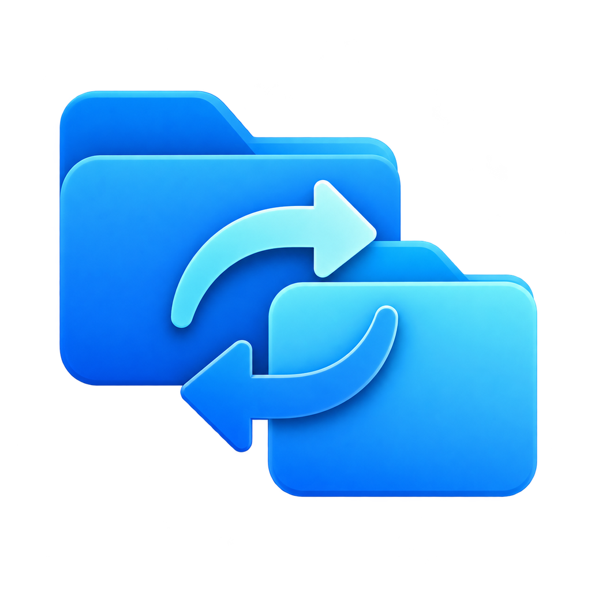
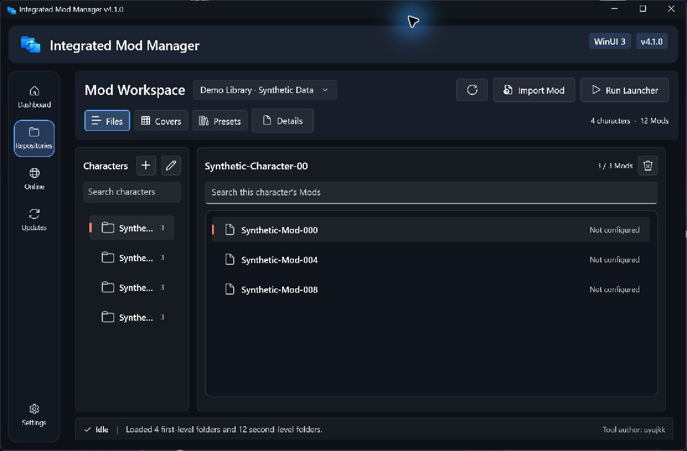
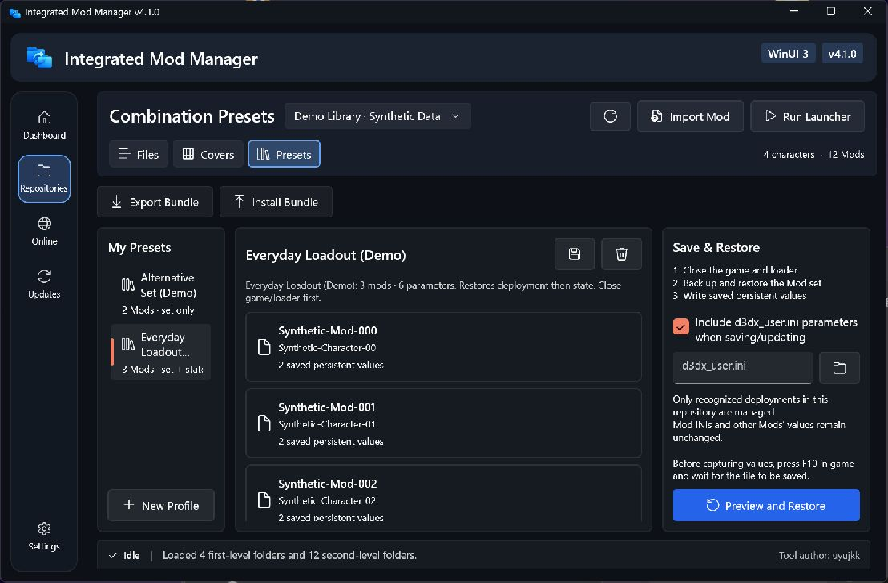
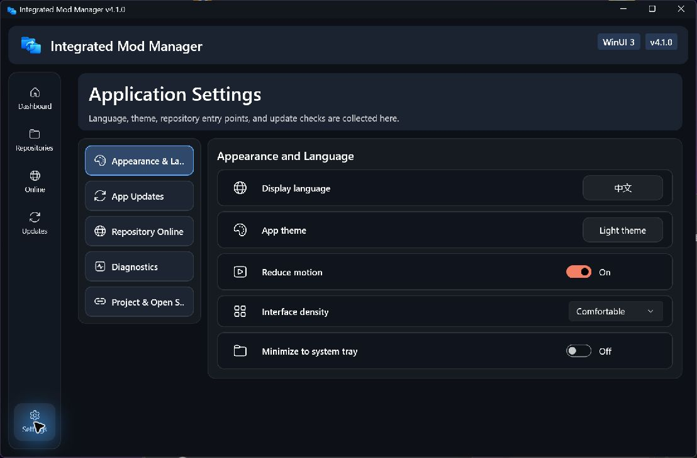

<div align="center">
  
  <h1>Integrated Mod Manager</h1>
  <p>A WinUI 3 app for organizing, switching, browsing, and updating mods on Windows 10/11</p>

  [](https://github.com/uyujkk/Integrated_Mod_Manager/actions/workflows/build-and-test.yml)
  [](https://github.com/uyujkk/Integrated_Mod_Manager/releases/latest)
  [](./LICENSE)
  [](#requirements)

  [中文](./README.zh-CN.md) · **English**

  [Download Latest](https://github.com/uyujkk/Integrated_Mod_Manager/releases/latest) ·
  [Quick Start](./docs/guides/Quick-Start.en.md) ·
  [Full Guide](./docs/guides/User-Guide.en.md) ·
  [Changelog](./docs/releases/CHANGELOG.md) ·
  [Screenshots](#interface-preview) ·
  [Report an Issue](https://github.com/uyujkk/Integrated_Mod_Manager/issues/new/choose)
</div>

> [!IMPORTANT]
> This is an unofficial fan-made tool. It is not affiliated with, endorsed by, authorized by, or sponsored by XXMI, any game publisher, or any related developer. Follow the rules of the relevant game, platform, and mod author.

## Overview

**Current stable version: [v4.1.0](https://github.com/uyujkk/Integrated_Mod_Manager/releases/tag/v4.1.0).** Export saved Mod combinations with their files and persistent settings, then install them in another repository. See the [preset guide](./docs/guides/Combination-Presets.en.md).

Integrated Mod Manager organizes different games or mod environments into independent repositories. It copies or removes complete mod folders between a local library and the target directory read by the game, while keeping preview images, source links, shortcut notes, online downloads, update records, profiles, and installation backups in one application.

The application, launcher, and updater use version **4.1.0** (`4.1.0.0`). The tool is maintained by `uyujkk`. The Bandizip extraction fallback was contributed by [CaramelizedCUDA](https://github.com/CaramelizedCUDA). The earlier [4.0-beta](https://github.com/uyujkk/Integrated_Mod_Manager/releases/tag/v4.0-beta) remains archived separately.

## Interface Preview

Real screenshots of an isolated **4.1.0** app using synthetic folders and demonstration presets. No actual online Mod previews, character avatars or local filesystem paths are shown. The demo is not connected to a game or loader.

**Repository workspace** — browse characters and Mods, search your library, and switch between Files, Covers and Presets. This compact window keeps the library visible and opens details separately.



<details>
<summary>Combination presets and portable bundles</summary>

Save a Mod set with persistent values, review its members, and export or install a combination bundle. Restore uses a separate preview and confirmation step; the demonstration presets below are not playable Mods.



[How combination presets work](./docs/guides/Combination-Presets.en.md)

</details>

<details>
<summary>Settings in a restored window</summary>

When the full overview cannot fit, Settings switches to sections. Language, theme, density and tray controls stay accessible without squeezing the lower cards out of view.



</details>

## What's New in 4.1

- Portable combination bundles: export a saved preset with its Mod files and numeric state, then preview and install it in another repository.
- Identical installed Mods can be reused; different existing files are never overwritten by bundle import.
- Faster repository scanning and smoother large-library refreshes.
- Fixed online previews and character avatars; improved download cancellation and immediate installed-state refresh.
- Better short-window layouts, including section-based Settings when the full overview cannot fit.

Before capturing state, have the loader save it (usually F10). Close the game and loader before restoring. Mod INI defaults and unrelated runtime values are not rewritten. This is not universal compatibility with every Mod or a guarantee against account risk.

[Release notes](./docs/releases/v4.1.0.md) · [Upgrade guide](./docs/guides/Upgrade-v4.1.en.md) · [Wiki](https://github.com/uyujkk/Integrated_Mod_Manager/wiki)

## Core Features

| Feature | Description |
| --- | --- |
| Multiple repositories | Keep separate paths and online categories for different games or XXMI setups |
| Local mod switching | Browse, search, copy, remove, create, rename, and delete two-level mod folders |
| Optional directory junctions | Let the loader and library share one mod directory, safely replacing the previous link for the same character |
| Archive import | Import ZIP, 7Z, RAR, ZIPX, CAB, TAR, and common compressed stream formats |
| Previews and notes | Store an image, source link, shortcut keys, and action descriptions for each mod |
| Repository workspace | Switch between a compact file list and cover gallery; keep selection and actions together |
| Combination and state presets | Save enabled Mod sets with numeric persistent values; restore the set, then matching `d3dx_user.ini` values |
| Portable combination bundles | Export selected saved presets with Mod files; validate, preview, install and optionally restore them in another repository |
| Online mod browser | Browse GameBanana entries, filter by character, view details, and download and extract mods |
| Configuration profiles | Save and apply complete enabled-mod setups without touching unknown target folders |
| Installation safety | Detect file conflicts and create restorable backups for copy, remove, and profile operations |
| Download task center | Monitor download and extraction progress, cancel work, and open output folders |
| Updates and diagnostics | Check mod and app updates, roll back failed updates, and export sanitized diagnostics |
| Accessibility | Chinese/English, light/dark, high contrast, keyboard navigation, and display scaling |

## Download and Run

1. Open the [latest GitHub Release](https://github.com/uyujkk/Integrated_Mod_Manager/releases/latest).
2. Download `Integrated_Mod_Manager-vX.X.X.zip` and its matching `.sha256` file.
3. **Fully extract** the ZIP into a writable folder. Do not run it inside the archive.
4. Run `IntegratedModManager.exe` from the extracted root folder.
5. Create or select a repository, then configure the mod storage folder, target folder, and optional launcher.

`IntegratedModManager.exe` is the official launcher. The package temporarily retains `ModFolderCopier.exe` as a compatibility entry point for in-place updates from v3.8.5. The WinUI runtime is located at `WinUI3/ModFolderCopier.WinUI.exe`. Keep the release directory structure intact.

### SmartScreen Notice

The executable is not signed with a commercial code-signing certificate, so Windows SmartScreen may report an unknown publisher. Download only from this repository's Releases page, and do not disable Microsoft Defender to run the app. The source, build scripts, automated tests, and package verification flow are public in this repository.

## Quick Start

1. Create or select a repository on the Dashboard.
2. Set the Mod Storage Folder on the Dashboard to the root of a two-level mod directory.
3. Set the Target Folder to the Mods directory read by the game or mod loader.
4. Select a first-level category, then select a second-level mod.
5. Double-click the mod or use the deployment action in Details to toggle it. Selecting a Mod or switching views does not deploy it.

If the target does not contain a folder with the same name, the app copies the complete mod. If it already exists, running the action again removes it from the target. Deleting the source mod from the repository is a separate action and requires confirmation.

### Recommended Folder Layout

```text
Mod Storage Folder
├─ Character or Category A
│  ├─ Mod A1
│  └─ Mod A2
└─ Character or Category B
   └─ Mod B1
```

The first level is a character, purpose, or other category. The second level contains the complete mod folders managed by the app.

## v3.9.5 Update Summary

- Thanks to [CaramelizedCUDA](https://github.com/CaramelizedCUDA) for [PR #4](https://github.com/uyujkk/Integrated_Mod_Manager/pull/4): when 7-Zip is unavailable, the app can discover an installed Bandizip `bz.exe` and use it as a fallback for RAR, 7Z, ZIPX, CAB, and related archives. Existing 7-Zip priority and ZIP/TAR paths are preserved.
- The Bandizip path uses a temporary snapshot and archive link/path checks. Unsupported or suspicious archives stop with an explicit error rather than bypassing validation. Each tar/bz invocation has a 10-minute limit; this also applies to the existing TAR import path.
- Online Mod lists and details now show installed status. Tracked Mods scroll inside their panel, Install Safety moves to the right column, and restoring from the system tray attempts to bring the app to the foreground.
- Both the main app and standalone Developer Tools have v3.9.5 ZIPs and SHA-256 checksums. Developer Tools remains separate from the main app updater payload.

See the [v3.9.5 Release Report](./docs/releases/v3.9.5.md) for details.

## v3.9.4 Update Summary

- Refined the Updates workspace: tracked Mods use a responsive two-column card layout on wide screens, profile actions share one compact row, and narrow windows automatically return to a single column.
- Online items with multiple files now default to the newest usable archive. The details pane retains manual selection with version, date, size, and archive state.
- Online installation decodes real image dimensions and chooses a clear, normally proportioned detail image for the local Mod preview instead of directly saving the low-resolution list thumbnail.
- Restored automatic character-folder routing through category IDs, localized character names, Wiki names, and aliases. Ambiguous results are never guessed.
- Improved wide-screen use and information hierarchy across online cards, Settings, and Updates, with open-source dependency, project, and author links in Settings.
- Added a separately released graphical Developer Tools app for checking versions, repository paths, directory junctions, configuration, logs, caches, backups, and sanitized diagnostics. It remains outside the main updater package.
- The main app and standalone Developer Tools archives each include a SHA-256 checksum file.

## v3.9.0 Major Update

- Rebuilt the Dashboard, repository workspace, online browser, updater, and settings surfaces with responsive wide, split, and compact layouts. Dashboard path and game-preset cards now share an exact baseline on wide screens.
- Moved per-repository path configuration and status to the Dashboard. The app can minimize to the system tray while keeping repository, Mod count, online source, and version details visible.
- Added read-only shortcut discovery from `[Key...]` sections in Mod `.ini` files, readable descriptions localized to the current app language, and an editor without the previous 10-row limit.
- Added Arknights: Endfield GameBanana/Wiki presets and online operator-catalog refresh alongside the existing Genshin Impact, Zenless Zone Zero, and Honkai: Star Rail presets.
- Fixed archive-picker crashes and regressing or jumping download progress while preserving safe archive validation, directory-junction deployment, and failed-update rollback.
- Renamed the public launcher to `IntegratedModManager.exe`; one legacy entry point remains in this release so v3.8.5 installations can update in place.
- Expanded automated verification to **146 tests**, retaining coverage gates, WinUI x64 builds, release-package validation, and update-agent transaction tests.

See the [Changelog](./docs/releases/CHANGELOG.md) for the complete bilingual history and the [v3.9.5 Release Report](./docs/releases/v3.9.5.md) for release and verification details.

## Documentation

| Document | Chinese | English |
| --- | --- | --- |
| Quick use | [快速使用手册](./docs/guides/快速使用手册.md) | [Quick Start](./docs/guides/Quick-Start.en.md) |
| Complete guide | [详细中文手册](./docs/guides/用户手册.zh-CN.md) | [Complete User Guide](./docs/guides/User-Guide.en.md) |
| Combination and state presets | [组合与状态预设](./docs/guides/Combination-Presets.zh-CN.md) | [Combination and State Presets](./docs/guides/Combination-Presets.en.md) |
| Upgrade to 4.0 | [升级指南](./docs/guides/Upgrade-v4.0.zh-CN.md) | [Upgrade Guide](./docs/guides/Upgrade-v4.0.en.md) |
| Release history | [Bilingual Changelog](./docs/releases/CHANGELOG.md) | [Bilingual Changelog](./docs/releases/CHANGELOG.md) |
| Cross-mod state experiments | [Current conclusions](./docs/research/跨Mod状态保存试验结论.md) | [Current conclusions](./docs/research/跨Mod状态保存试验结论.md) |
| Tests and builds | [Testing Guide](./docs/development/TESTING.md) | [Testing Guide](./docs/development/TESTING.md) |
| 4.1 source optimization | [源码优化记录](./docs/development/Source-Optimization-v4.1.md) | [Source Optimization Record](./docs/development/Source-Optimization-v4.1.md) |
| Contributions | [Contributing](./CONTRIBUTING.md) | [Contributing](./CONTRIBUTING.md) |
| Security | [Security Policy](./SECURITY.md) | [Security Policy](./SECURITY.md) |

## Requirements

- Windows 10 version 1809 or later; Windows 11 is recommended.
- 64-bit Windows (`x64`).
- Online browsing, translation, and update checks require a network connection.
- The release bundles the Windows App SDK but requires the .NET 8 x64 runtime. Regular users do not need the .NET SDK or Visual Studio.
- 7Z, RAR, ZIPX, and CAB prefer bundled or installed 7-Zip. If unavailable, the app uses an installed Bandizip's `bz.exe`, with Windows `tar.exe` checking paths and links before extraction.

## Build from Source

Development requires Windows 10/11 x64, the .NET 8 SDK, Visual Studio 2022 or Build Tools 2022, MSBuild, Windows App SDK, and Windows SDK.

```powershell
cmd /c build_winui.bat
```

Run the complete test, coverage, WinUI x64 build, and package verification flow:

```powershell
powershell -NoProfile -ExecutionPolicy Bypass -File .\scripts\test-all.ps1
```

GitHub Actions runs the same three-suite verification flow on pushes to `main`, pull requests, and manual dispatches. Test dependencies are centralized without removing safety cases. See the [Testing Guide](./docs/development/TESTING.md) and [4.1 verification record](./docs/verification/v4.1.0.md) for current results and testing boundaries.

## Data and Security

- Repository paths, interface settings, and online caches remain on the local computer and are not automatically uploaded by this project.
- Diagnostic reports exclude access credentials and sanitize user paths, but users should still review them before submitting.
- The app does not bypass payments, subscriptions, permissions, CAPTCHAs, or restrictions set by mod authors.
- Do not disclose local configuration files, personal paths, access tokens, or other sensitive information in issues, screenshots, or archives.
- Follow [SECURITY.md](./SECURITY.md) when reporting a security issue.

## License and Notices

This project is available under the [MIT License](./LICENSE), copyright `uyujkk`. Third-party components retain their own licenses; bundled 7-Zip files include their license text.

The tool does not include game files or mod content. Rights related to games, characters, images, mods, and third-party services belong to their respective owners.
